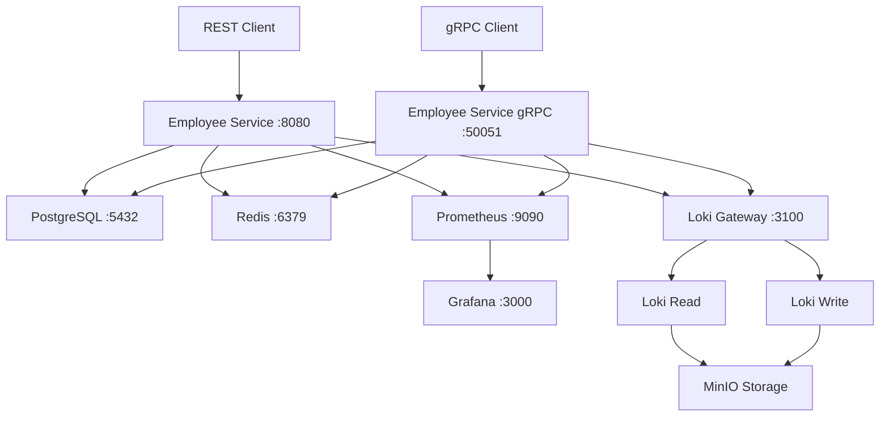

# 🏢 Employee Service

[](https://golang.org/)
[](./cmd/api.swagger.yaml)
[](LICENSE)


**Employee Service** — это современный микросервис для управления сотрудниками в рамках системы HRGate. Сервис обеспечивает полный цикл управления профилями сотрудников, организационной структурой, авторизацией и мониторингом через REST API и gRPC интерфейсы.

## 📋 Содержание

- [✨ Основные возможности](#-основные-возможности)
- [🏗️ Архитектура](#️-архитектура)
- [🚀 Быстрый старт](#-быстрый-старт)
- [⚙️ Конфигурация](#️-конфигурация)
- [📝 API Документация](#-api-документация)
  - [REST API](#основные-эндпоинты)
  - [gRPC API](#grpc-api)
- [🔒 Авторизация](#-авторизация)
- [📊 Мониторинг](#-мониторинг)
- [🧪 Тестирование](#-тестирование)
- [📁 Структура проекта](#-структура-проекта)

## ✨ Основные возможности

### 👥 Управление сотрудниками
- ✅ **CRUD операции** с профилями сотрудников
- ✅ **Фильтрация** по роли, департаменту, статусу
- ✅ **Управление отпусками** и больничными днями
- ✅ **Иерархия сотрудников** (руководители и подчиненные)
- ✅ **Статусы сотрудников** (активный, уволен, приостановлен)

### 🏢 Управление департаментами
- ✅ **Организационная структура** с возможностью вложенности
- ✅ **Назначение руководителей** департаментов
- ✅ **CRUD операции** с департаментами

### 🔐 Система авторизации
- ✅ **JWT токены** для аутентификации
- ✅ **Ролевая модель**: Admin, HR, Manager, Employee
- ✅ **Защищенные эндпоинты** с проверкой прав доступа
- ✅ **Redis кэширование** для сессий

### 🚀 API и Производительность
- ✅ **Dual API**: REST API + gRPC для разных сценариев использования
- ✅ **Protocol Buffers** для эффективной сериализации
- ✅ **gRPC Gateway** для HTTP/JSON транскодинга
- ✅ **OpenAPI 3.0** спецификация для REST API
- ✅ **Типизированные клиенты** для многих языков программирования

### 📊 Мониторинг и логирование
- ✅ **Prometheus метрики** для мониторинга производительности
- ✅ **Grafana дашборды** для визуализации
- ✅ **Loki логирование** с централизованным сбором логов
- ✅ **Структурированное логирование** с помощью slog
- ✅ **Healthcheck эндпоинты**

## 🏗️ Архитектура



### Технологический стек:
- **Backend**: Go 1.23.3 с Chi router
- **API**: REST API (OpenAPI 3.0) + gRPC с Protocol Buffers
- **gRPC Gateway**: HTTP/JSON транскодинг для gRPC методов
- **База данных**: PostgreSQL с миграциями
- **Кэш**: Redis для сессий и токенов
- **Мониторинг**: Prometheus + Grafana
- **Логирование**: Loki + Grafana Alloy
- **Контейнеризация**: Docker + Docker Compose

## 🚀 Быстрый старт

### Предварительные требования
- Docker и Docker Compose
- Go 1.23.3+ (для разработки)
- Make (опционально)

### 1. Клонирование репозитория
```bash
git clone <repository-url>
cd employee-service
```

### 2. Запуск с помощью Docker Compose
```bash
# Запуск всех сервисов (база данных, Redis, мониторинг)
docker-compose -f docker/docker-compose.yaml up -d

# Проверка статуса сервисов
docker-compose -f docker/docker-compose.yaml ps
```

### 3. Проверка работы сервиса
```bash
# Проверка health check
curl http://localhost:8080/health

# Проверка метрик
curl http://localhost:8080/metrics
```

### 4. Доступ к веб-интерфейсам
- **Employee Service REST API**: http://localhost:8080
- **Employee Service gRPC**: localhost:50051
- **Grafana Dashboard**: http://localhost:3000 (admin/admin)
- **Prometheus**: http://localhost:9090
- **Swagger UI**: http://localhost:8080/swagger/

## ⚙️ Конфигурация

Основная dev конфигурация находится в файле `configs/config.toml`:

```toml
[server]
host = "0.0.0.0:8080"        # REST API сервер
grpc_host = "0.0.0.0:50051"  # gRPC сервер
jwt_secret = "your-secret-key"
write_timeout = "10s"
read_timeout = "10s"
read_header_timeout = "10s"

[database]
host = "postgres"
user = "postgres"
password = "admin21"
database = "employee_dev"
port = "5432"

[redis]
redis_addr = "redis:6379"
redis_password = "redis_password123"
redisdb = 0
access_token_ttl = "24h"
refresh_token_ttl = "168h"
```

### Переменные окружения
Можно переопределить настройки через переменные окружения:
- `DB_HOST`, `DB_PORT`, `DB_USER`, `DB_PASSWORD`, `DB_NAME`
- `REDIS_HOST`, `REDIS_PORT`, `REDIS_PASSWORD`
- `JWT_SECRET`

## 📝 API Документация

### Основные эндпоинты

#### 🔐 Авторизация
```http
POST /api/v1/auth/login     # Вход в систему
POST /api/v1/auth/logout    # Выход из системы
```

#### 👥 Сотрудники
```http
GET    /api/v1/employees         # Список сотрудников (фильтры: role, department_id, status)
POST   /api/v1/employees         # Создание сотрудника
GET    /api/v1/employees/{id}    # Получение сотрудника по ID
PUT    /api/v1/employees/{id}    # Обновление сотрудника
DELETE /api/v1/employees/{id}    # Удаление сотрудника
POST   /api/v1/employees/{id}/vacation  # Запрос отпуска
```

#### 🏢 Департаменты
```http
GET    /api/v1/departments       # Список департаментов
POST   /api/v1/departments       # Создание департамента
GET    /api/v1/departments/{id}  # Получение департамента по ID
PUT    /api/v1/departments/{id}  # Обновление департамента
DELETE /api/v1/departments/{id}  # Удаление департамента
```

### Пример запроса авторизации
```bash
curl -X POST http://localhost:8080/api/v1/auth/login \
  -H "Content-Type: application/json" \
  -d '{
    "email": "admin@company.com",
    "password": "password123"
  }'
```

### Пример создания сотрудника
```bash
curl -X POST http://localhost:8080/api/v1/employees \
  -H "Content-Type: application/json" \
  -H "Authorization: Bearer <your-jwt-token>" \
  -d '{
    "first_name": "Иван",
    "last_name": "Иванов",
    "email": "ivan.ivanov@company.com",
    "role": "employee",
    "department_id": 1,
    "position": "Разработчик",
    "status": "active"
  }'
```

### gRPC API

📡 **gRPC сервис работает на порту 50051** и поддерживает все те же операции, что и REST API.

#### Особенности gRPC реализации:
- ✅ **Protocol Buffers** для эффективной сериализации
- ✅ **gRPC Gateway** для HTTP/JSON транскодинга
- ✅ **Быстродействие** и малый размер сообщений
- ✅ **Обратная совместимость** схемы
- ✅ **Типизированные клиенты** для различных языков

#### Protocol Buffers спецификация:
Спецификация gRPC сервиса находится в файле:
```
internal/api/grpc/configs/employee_service.proto
```

#### Пример использования gRPC с grpcurl:

```bash
# Проверка доступных методов
grpcurl -plaintext localhost:50051 list

# Получение схемы сервиса
grpcurl -plaintext localhost:50051 describe employee_service.EmployeeService

# Пример авторизации
grpcurl -plaintext -d '{
  "email": "admin@company.com",
  "password": "password123"
}' localhost:50051 employee_service.EmployeeService/AuthLogin

# Получение списка сотрудников
grpcurl -plaintext -d '{}' localhost:50051 employee_service.EmployeeService/GetEmployees
```

#### Генерация gRPC кода:

```bash
# Обновление зависимостей Protocol Buffers
cd internal/api/grpc/configs
buf dep update

# Генерация Go кода из .proto файлов
buf generate
```

#### Преимущества gRPC перед REST:
- 🚀 **Производительность**: бинарные данные + HTTP/2
- 📝 **Строгая типизация**: определение схемы в .proto
- 🔄 **Streaming**: поддержка стриминга данных
- 🌐 **Мультиязычность**: кодогенерация для 10+ языков

## 🔒 Авторизация

Сервис использует JWT токены для авторизации с ролевой моделью доступа:

### Роли и права доступа:

| Роль | Права |
|------|-------|
| **Admin** | Полный доступ ко всем операциям |
| **HR** | Управление сотрудниками и департаментами (кроме админских) |
| **Manager** | Просмотр подчиненных, ограниченное редактирование |
| **Employee** | Просмотр и редактирование собственного профиля |

### Использование токенов:
```bash
# Получение токена
TOKEN=$(curl -s -X POST http://localhost:8080/api/v1/auth/login \
  -H "Content-Type: application/json" \
  -d '{"email":"user@example.com","password":"password"}' | \
  jq -r '.data.token')

# Использование токена в запросах
curl -H "Authorization: Bearer $TOKEN" \
  http://localhost:8080/api/v1/employees
```

## 📊 Мониторинг

### Prometheus метрики
- `http_requests_total` - общее количество HTTP запросов
- `http_request_duration_seconds` - время выполнения запросов
- Custom метрики бизнес-логики

### Grafana дашборды
После запуска доступны по адресу http://localhost:3000:
- **Employee Service Dashboard** - основные метрики сервиса
- **Infrastructure Dashboard** - метрики инфраструктуры
- **Logs Dashboard** - централизованные логи через Loki

### Логирование
Структурированные логи в JSON формате:
```json
{
  "time": "2024-01-15T10:30:00Z",
  "level": "INFO",
  "msg": "Employee created successfully",
  "employee_id": 123,
  "user_id": 456,
  "request_id": "req-789"
}
```

## 🧪 Тестирование

### Запуск тестов
```bash
# Все тесты
go test ./...

# С покрытием
go test -cover ./...

# Интеграционные тесты (требует запущенные сервисы)
go test -tags=integration ./...
```

### Миграции базы данных
```bash
# Применение миграций
go run cmd/migrate/main.go up

# Откат миграций
go run cmd/migrate/main.go down

# Создание новой миграции
go run cmd/migrate/main.go create <migration_name>
```

## 📁 Структура проекта

```
employee-service/
├── 📁 cmd/                     # Точки входа приложения
│   ├── 📄 main.go             # Основной сервер
│   └── 📄 api.swagger.yaml    # OpenAPI спецификация
├── 📁 configs/                # Конфигурационные файлы
│   └── 📄 config.toml         # Основная конфигурация
├── 📁 docker/                 # Docker файлы и композиции
│   ├── 📄 Dockerfile          # Образ приложения
│   ├── 📄 docker-compose.yaml # Полный стек сервисов
│   └── 📄 *.yaml              # Конфигурации мониторинга
├── 📁 internal/               # Внутренняя логика приложения
│   ├── 📁 api/                # API слой (обработчики и маршруты)
│   │   ├── 📁 rest/           # REST API обработчики
│   │   └── 📁 grpc/           # gRPC сервер и обработчики
│   │       ├── 📁 configs/    # Protocol Buffers спецификации
│   │       │   ├── 📄 employee_service.proto  # gRPC сервис определение
│   │       │   ├── 📄 buf.yaml              # Buf конфигурация
│   │       │   └── 📄 buf.lock              # Buf зависимости
│   │       ├── 📁 proto/       # Сгенерированные Go файлы
│   │       │   ├── 📄 *.pb.go           # Protocol Buffers структуры
│   │       │   ├── 📄 *_grpc.pb.go      # gRPC клиент и сервер
│   │       │   └── 📄 *.pb.gw.go        # gRPC Gateway код
│   │       └── 📄 server.go       # gRPC сервер реализация
│   ├── 📁 config/             # Загрузка конфигурации
│   ├── 📁 database/           # Подключения к БД и Redis
│   ├── 📁 models/             # Модели данных
│   ├── 📁 services/           # Бизнес-логика
│   └── 📁 utils/              # Вспомогательные утилиты
├── 📁 migrations/             # SQL миграции базы данных
├── 📄 go.mod                  # Go модули
├── 📄 go.sum                  # Зависимости
├── 📄 .golangci.yml          # Конфигурация линтера
└── 📄 README.md               # Этот файл
```

---

## 🤝 Участие в разработке

1. Fork проекта
2. Создайте feature ветку (`git checkout -b feature/AmazingFeature`)
3. Commit изменения (`git commit -m 'Add some AmazingFeature'`)
4. Push в ветку (`git push origin feature/AmazingFeature`)
5. Откройте Pull Request

---

## 📞 Поддержка

Если у вас возникли вопросы или проблемы:
- 📧 Создайте Issue в репозитории
- 💬 Обратитесь к команде разработки
- 📚 Изучите документацию API в Swagger UI

---

**Employee Service** является частью экосистемы **HRGate** для комплексного управления человеческими ресурсами.
